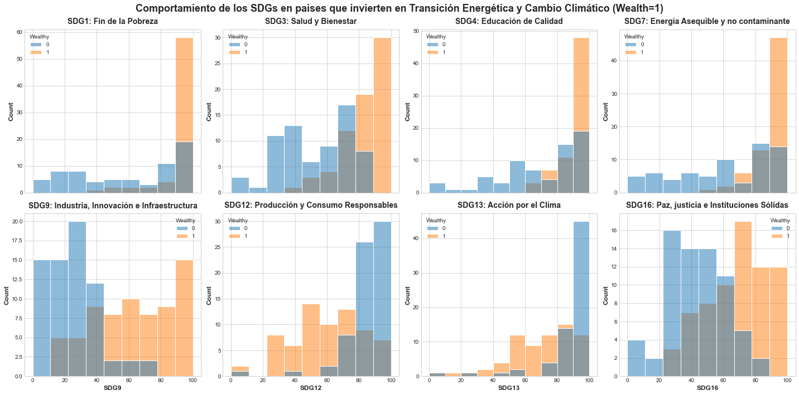
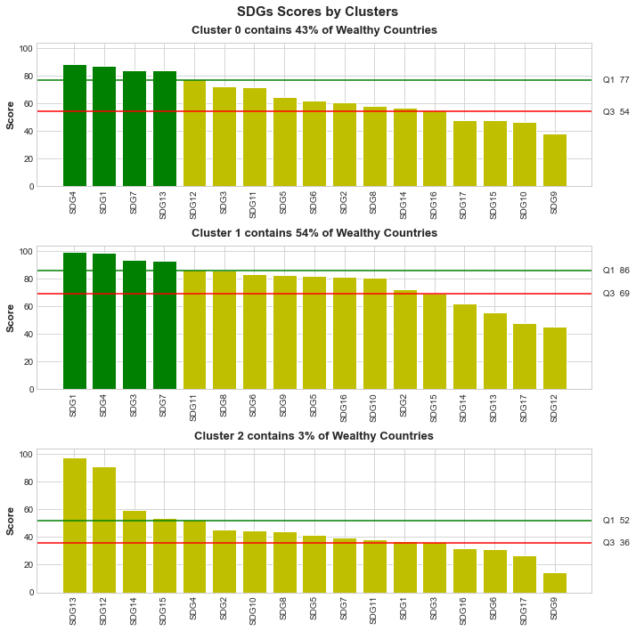
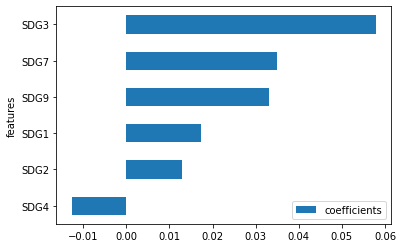

# 1.- Project description
### 1.1 Project title
#### *"Connecting the Sustainable Development Goals with climate change and energy transition"*.
### 1.2 Theme
**Climate change and the energy transition** towards a decarbonized economy is one of the **world's great challenges (GC)** to ensure that our planet survives. To address the GC of our planet, the United Nations has defined the **Sustainable Development Goals (SDGs)**, a set of **17 global objectives**. Governments have agreed that these SDGs must be achieved by 2030 *(Guterres, 2019)*. 
The set of 17 SDGs is considered one of the most effective frameworks for translating GCs into manageable targets for each country. Despite this comprehensive vision, **there are certain conditions marked by a socioeconomic-environmental model and by the situation of the countries, which cause progress towards the achievement of some SDGs without achieving others**.

### 1.3 Objective
 **The objective of this project is to study the relationship of the SDGs with climate change and energy transition**.
 
### 1.4 Datasets and alternative data sources
We focus the analysis on data from **137 countries** worldwide for the years **2017, 2018, 2019 and 2020**, on which we will mainly analyse the **17 SDGs** in their relationship with **climate change and energy transition (9,384 observations)**. Which data is used:

* A ranking of these 137 countries produced by the **[17 SDGs of the 2020 Sustainable Development Report](https://unstats.un.org/sdgs/dataportal)** *(Sachs et al., 2020)*.
* According to the **International Energy Agency**, renewable energy contributes 80% to climate change and the energy transition. Therefore, investment in renewable energy (RE) in greenfield projects is used as the study variable, in particular, we use **renewable non-hydroelectric generation per capita in units of kWh/capita as a proxy**. This measure is widely used in the literature *(Baldwin, Carley, Brass, & MacLean, 2016; Carley, 2009; Romano & Scandurra, 2014; Romano, Scandurra, Carfora, & Fodor, 2017)*. Data comes from the database of the **[International Energy Agency](https://www.iea.org/data-and-statistics)**.
* Three **qualitative variables: country, region, and country level of development** as defined by the **[World Bank's World Development Indicators (WDI) database](https://databank.bancomundial.org/source/world-development-indicators)**.

# 2.- Machine Learning Workflow
### 2.1 Definition of the Problem
Three main tasks have been carried out to respond our objectives:

1. **PREDICTION**: which answers the questions... can SGDs achieve "climate change and energy transition"?. Are models able to predict "climate change and energy transition" from SDGs?.
3. **SEGMENTATION OF THE SDGs**: which answers the question... what are the most relevant SDGs?.
4. **ANALYSIS OF COEFFICIENTS AND DIRECTION OF DEPENDENT VARIABLES**: which answers the question... does any SDG help to achieve or prevent "climate change and the energy transition"?.

Models used are appropriate for the main tasks of our development (prediction, segmentation, and analysis of the coefficients and direction of dependent variables). Thus, we have used the following:

#### 2.1.1 Prediction
* Pipeline PCA RandomForest Regression model
* Pipeline PCA DecisionTree Regression model
* Pipeline PCA XGBRegressor Regression model
* Pipeline PCA KNN Classification model

#### 2.1.2 Segmentation
* KMeans Clustering models

#### 2.1.3 Analysis of Coefficients and Direction
* Linear Polynomial Regression models 
* Support Vector Regression model
* Decision Trees Regression model
* PCA models
* Panel Data Regression models

### 2.2 Data collection and cleaning
1. **Data Source**: data has been loaded from the sources listed above.
2. **Outliers**: outliers are not eliminated, they mainly correspond to the Nordic countries and Germany, more aware of climate change and energy transition.
3. **Missing data**: imputations with respect to the previous and subsequent years are applied. They are based on linear regression.
4. **Anomalies and errors**: values are controlled to be in adequate ranges.

### 2.3 EDA
Different regression, classification, variable reduction, and clustering models are used to perform our tasks. Most relevant data and graphs are shown hereafter.

1. **Balanced Data**: target variable in the classification analysis is balanced. The target variable "renewable non-hydroelectric generation per capita" is dichotomized with the median, to differentiate "wealthy" countries (target value 1) that have greater investment in renewables from "unwealthy" countries (target value 0). Note: this variable is used in its continuous form for the regression analysis.
2. **Correlations**: SDG15, SDG14 and SDG17 variables present a correlation < 0.2 with the target variables. Tests are carried out to eliminate them without significant improvement. So, it is decided to keep them to see the interactions with other SDGs. The SDGs with the highest correlation with the target variable are SDG9 = 0.46, SDG16 = 0.45, and SDG12 = -0.44, which are not considered very high. 
3. **Plots**: significant effects are detected between wealthy vs. unwealthy countries with some dependent variables during classification analysis. SDG1, SDG3, SDG4, SDG7, SDG9 and SDG16 variables include more wealthy countries for their higher values, while SDG13 and SDG3 variables present more wealthy countries in their lower values.

4. **Data**: SDGs rankings and scores are collected for the different years. Scores present better results and capture better continuity for each SDG.
5. **Skewness**: data does not show high Skewness. Logarithmic transformations are performed, not presenting substantial improvement for most variables. Logarithmic transformation was performed when was deemed appropriate.
6. **Data escalation**: StandardScaler is applied for clustering algorithms, ensembles and PCAs.
7. **Metrics for classification**: Accuracy is used in classification algorithms since data is balanced. The coefficient of determination for the prediction (score) is analysed. The minimization of the **Mean Squared Error (MSE)** is sought, as there were not many outliers (5) that could suggest the use of the Mean Absolute Error (MAE).
8. **Regularization**: **GridSearchCV** is used, combined with a massive hyperparameter evaluation with loops, to facilitate the evaluation of metrics and regularization.

#### 2.4.1 REGRESSION

**Pipeline PCA RandomForest Regression model**
* Train Split 2021 Coefficient of Determination: 0.83
* Test Split 2021 Coefficient of Determination: 0.92
Only 80% of the year 2021 was used to train. It generalizes in an appropriate manner with the remaining years:
* Test 2017 Coefficient of Determination: 0.79
* Test 2018 Coefficient of Determination: 0.76
* Test 2020 Coefficient of Determination: 0.78

**Pipeline PCA DecisionTree Regression model**
* Train Split 2021 Coefficient of Determination: 1.0
* Test Split 2021 Coefficient of Determination: 0.94
* Test Split 2021 Determination coefficient: 0.94
Only 80% of the year 2021 was used to train. It generalizes in an appropriate manner with the 2021 year, and not adequately with the other years:
* Test 2017 Coefficient of Determination: 0.16
* Test 2018 Coefficient of Determination: 0.15
* Test 2020 Coefficient of Determination: 0.19

**Pipeline PCA XGBRegressor Regression model**
* Train Split 2021  Coefficient of Determination: 0.98
* Test Split 2021  Coefficient of Determination: 0.91
Only 80% of the year 2021 was used to train. It generalizes in an appropriate manner with the 2021 year, and not adequately with the other years:
* Test 2017:  Coefficient of Determination: 0.18
* Test 2018:  Coefficient of Determination: 0.16
* Test 2020  Coefficient of Determination: 0.22

#### 2.4.2 CLASSIFICATION

**Pipeline PCA k-Nearest Neighbours Classification model**
* Train Split 2021 Accuracy: 0.88
* Test Split 2021 Accuracy: 0.82
Only 80% of the year 2021 was used to train. It generalizes in an appropriate manner with the remaining years:
* Test 2017 Accuracy: 0.77
* Test 2018 Accuracy: 0.77
* Test 2020 Accuracy: 0.77

The code for these models is provided in the src directory, the rest are left in the src/notebooks directory.

The main models have been dumped in the src/model directory. For each of them, three files have been generated with the same format as those generated previously, that is:

        <modelname>: the model dumped by pickle
        <modelname>.json: a JSON with the description (according to the previous delivery).
        <modelname>.csv: contains the test data for the independent and dependent variables.

In the src/model directory, my_model is left (with its respective three files). This is the model chosen for the Pipeline with StandardScaler, PCA, and DecisionTree Regression. A src/train.py file is left that trains this model.

### 2.5 MODELS USED FOR SEGMENTATION

**KMeans Clustering models**

Quantiles are calculated for the countries' score for each of the SDGS (dependent variables). It is detected who are more wealthy countries in the 1st quantile (the most relevant SDGs) and 4th quantile (the least relevant SDGs). As said, countries in the **"wealthy" category = 1 have greater investment in renewables, i.e. have more progress in "climate change and energy transition"**. Thus, here **relevance means the SDG in question contributes more to the country's progress in “climate change and energy transition”**.

**Clusters 1 and Cluster 0 present 43% and 54% of wealthy countries respectively**.
* **The most relevant (1st Quantile): SDG1, SDG4, SDG7, SDG13, SDG3**.
* **The least relevant (4th Quantile): SDG14, SDG17, SDG12, SDG15**.

In **Clusters 1, Cluster 2 and Cluster 2 the following is observed**:
* **The most relevant: SDG4**
* **The least relevant: SDG17**

These details can be seen in the following figure:

 

### 2.5 MODELS USED FOR THE ANALYSIS OF COEFFICIENTS AND DIRECTION
The following models have been used:

**Panel Data models (regression)**
* **Why?**: they are suitable white box algorithms for n individuals (countries), where the individuals and the variables “x” (SDGs) and “y” (“climate change and energy transition”) remain the same over time.
* **ADVANTAGES**: reduces collinearity, captures unobservable heterogeneity, reflects Granger dynamics and causality (cause-effect), etc. 

The following models have been used within this category:
* **Pooled Regression**
* **Fixed Effects (FE)**
* **Random Effects (RE)**

In our case, the **homoscedasticity** and **non-autocorrelation** conditions are violated, so Pooled Regression is not recommended. Conditions have been tested with several tests. For the **homoscedasticity** condition, graphical analysis is used. For **heteroskedasticity** condition, the **White** and **Breusch-Pagan** tests were used. For the **non-autocorrelation** condition, a **Durbin-Watson** test was performed.

Finally, we concluded the **Fixed Effects model was the most appropriate** after performing the **Hausman** test. In this case, the dependent variable has been logarithmically transformed. This means, if the coefficient of the dependent variable was significant and had a value of 0.198, for each increase of one unit in the independent variable, our dependent variable would increase by approximately 21.9% %, calculated as (e^0.198) – 1) * 100 = 21.9%.
         
The statistically significant coefficients are shown in the following figure:

**“Random Forest Regression” and “XGBRegressor Regression” models**

Feature importance and permutation importance have been examined. They are aligned with the results obtained in previous models.

**“PCAs” model**

SDG12 and SDG13 are grouped within PC1 (0.55 of explained variance), they had a negative direction with our target.

# 3.- Results and conclusions
## 3.1 PREDICTION TASK
It is feasible to make models to predict “climate change and energy transition” from SDGs. Thus, the global challenge of "climate change and energy transition" is achievable with stated SDGs.

## 3.2 SEGMENTATION, COEFFICIENT AND DIRECTION ANALYSIS
**SDG4 "Quality Education"** is the MOST RELEVANT Objective 

**SDG17 "Partnerships to achieve the objectives"** which consists in mobilizing resources to develop underdeveloped countries, has LOW RELEVANCE AND INGENUITY. This implies:
* An **"imperfect global governance"**: there is no counterweight to the inequalities between developed and developing countries.
* A **"trap for undeveloped countries"**.

**SDG9 "Industry, innovation and infrastructure"** shows:
* The importance of the **industrial "agglomeration", technological cluster, etc**.

**SDG12 "Responsible Production and Consumption"** and **SDG13 "Climate Action"**, they are opposed both with "climate change and energy transition". This implies:
* **The need to decouple SDG 12 and SDG 13 from the prevailing socioeconomic and environmental model**, which is based on legacy systems of production and consumption supported by fossil fuels. Examples: the global plastic production rate based on fossil fuels; petro-states and fossil fuel subsidies.
* **False hypocrisy"**: countries can invest in "energy transition" and to be polluting much more with fossil fuels in the net balance.

# 3. Bibliography

* *Baldwin, E., Carley, S., Brass, J. N., & MacLean, L. M. 2016. Global renewable electricity policy: A comparative policy analysis of countries by income status. Journal of Comparative Policy Analysis: Research and Practice, 19(3): 277-298.*
* *Carley, S. 2009. State renewable energy electricity policies: An empirical evaluation of effectiveness. Energy Policy, 37(8): 3071-3081.*
* *Guterres, A. 2019. Remarks to high-level political forum on sustainable development. 24 September 2019, United Nations Secretary General.*
* *Romano, A. A., & Scandurra, G. 2014. Investments in renewable energy sources in OPEC members: A dynamic panel approach. Metodoloski Zvezki, 11(2): 93-106.*
* *Romano, A. A., Scandurra, G., Carfora, A., & Fodor, M. 2017. Renewable investments: The impact of green policies in developing and developed countries. Renewable and Sustainable Energy Reviews, 68: 738-747.*
* *Sachs, J., Schmidt-Traub, G., Kroll, C., Lafortune, G., & Fuller, G. 2020. The sustainable development goals and COVID-19. Sustainable development report 2020. Cambridge: Cambridge University Press.*

*I hope you like it, thanks!*.
